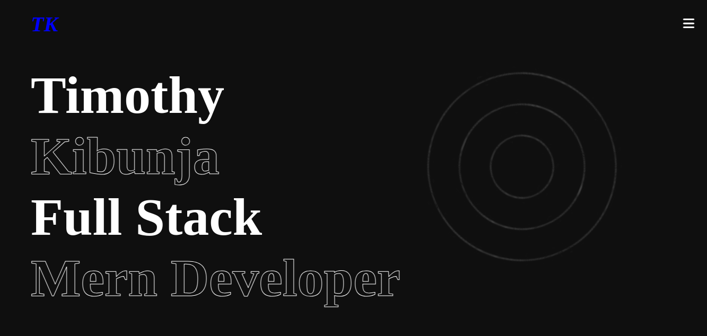
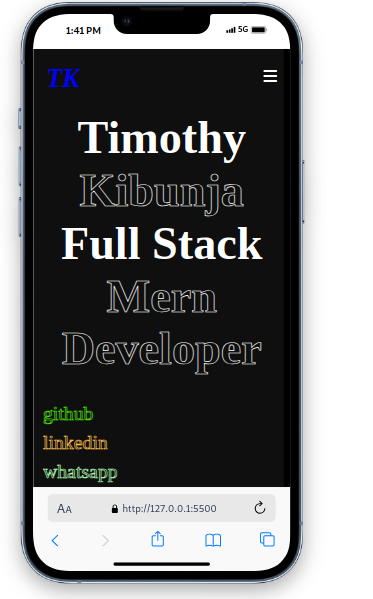

# plp-hackathon-portfolio-project
# Portfolio Website

Welcome to my personal portfolio website! This project showcases my work, skills, experience, and interests as a Full Stack MERN Developer. It features a clean, responsive design and interactive elements to provide a seamless user experience.

## 🚀 Features
- **Modern & Responsive UI**: Fully optimized for different screen sizes (mobile, tablet, desktop).
- **Smooth Navigation**: Intuitive and easy-to-use menu.
- **Animated Progress Bars**: Visual representation of skill proficiency.
- **Project Showcase**: Interactive cards displaying my key projects.
- **Downloadable Resume**: Allows users to download my CV with a single click.
- **Contact Form**: Visitors can reach out to me directly through the form.
- **Social Links**: Quick access to my GitHub, LinkedIn, and WhatsApp.

## 📂 Project Structure
```
|-- assets/                # Images, icons, and downloadable files
|-- css/                   # Stylesheets (style.css, responsive.css, keyframes.css)
|-- js/                    # JavaScript files (script.js)
|-- index.html             # Home page
|-- aboutMe.html           # About section
|-- resume.html            # Resume section (Education, Experience, Skills)
|-- contactMe.html         # Contact page
|-- README.md              # Project documentation
```

## 🛠️ Technologies Used
- **HTML5**
- **CSS3 (Flexbox, Grid, Animations, Media Queries)**
- **JavaScript (ES6, DOM Manipulation, Event Listeners)**

## 📜 How to Use
1. Clone the repository:
   ```sh
   git clone https://github.com/Tmoh-Squim/plp-hackathon-portfolio.git
   ```
2. Open `index.html` in your browser or deploy it using a static site host.
3. Customize content by editing the `.html` and `.css` files.

## 📷 Screenshots
### 💻 Desktop View:

### 📱 Mobile View:

### Live Link
https://tmoh-squim.github.io/plp-hackathon-portfolio-project/
## 📬 Contact
Feel free to reach out to me:
- **Email:** timooh3214@gmail.com
- **GitHub:** [Tmoh-Squim](https://github.com/Tmoh-Squim)
- **LinkedIn:** [Timothy Kibunja](https://www.linkedin.com/in/timothy-kibunja-8789342a2)

---

